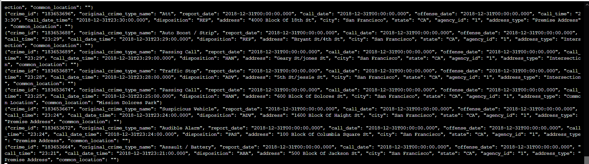
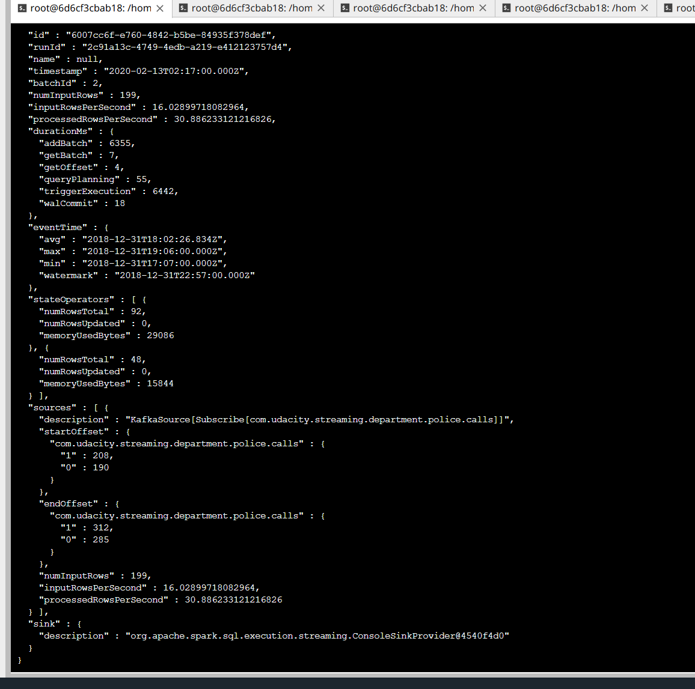
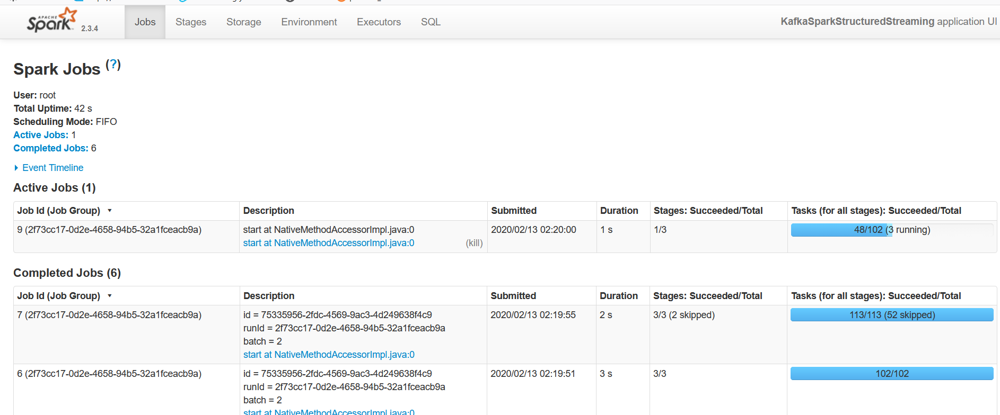

## Project Overview

In this project, you will be provided with a real-world dataset, extracted from Kaggle, on San Francisco crime incidents, and you will provide statistical analyses of the data using Apache Spark Structured Streaming. You will draw on the skills and knowledge you've learned in this course to create a Kafka server to produce data, and ingest data through Spark Structured Streaming.

## Development Environment

You may choose to create your project in the workspace we provide here, or if you wish to develop your project locally, you will need to set up your environment properly as described below:

    Spark 2.4.3
    Scala 2.11.x
    Java 1.8.x
    Kafka build with Scala 2.11.x
    Python 3.6.x or 3.7.x

## Steps
1) start up server in the terminal using the following command
	/usr/bin/zookeeper-server-start config/zookeeper.properties
	/usr/bin/kafka-server-start config/server.properties

2) To start kafka-console-consumer, 
/usr/bin/kafka-console-consumer --topic "com.udacity.streaming.department.police.calls" -bootstrap-server localhost:9092

3) spark-submit --packages org.apache.spark:spark-sql-kafka-0-10_2.11:2.3.4 --master local[*] data_stream.py

## Questions

1. How did changing values on the SparkSession property parameters affect the throughput and latency of the data?
by tweaking the value for spark.default.parallelism, spark.sql.shuffle.partitions and spark.streaming.kafka.maxRatePerPartition, it is observed the processedRowsperSecond which measure the throughput, the Duration for triggerExecution, and the duration reported in sparkui which measure the latency changes depending on the parameter set.

2. What were the 2-3 most efficient SparkSession property key/value pairs? Through testing multiple variations on values, how can you tell these were the most optimal?

spark.default.parallelism, spark.sql.shuffle.partions and spark.streaming.kafka.maxRatePerPartition. by trail and error and observe the processedRowPerSecond and duration for triggerexecution in progress report and the duration in sparkui.
